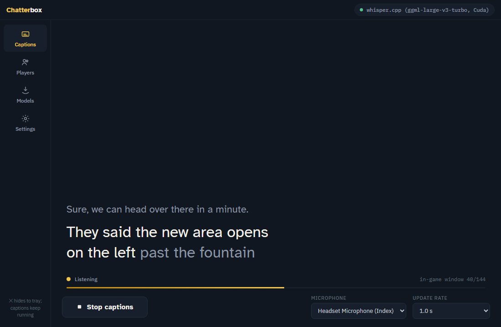
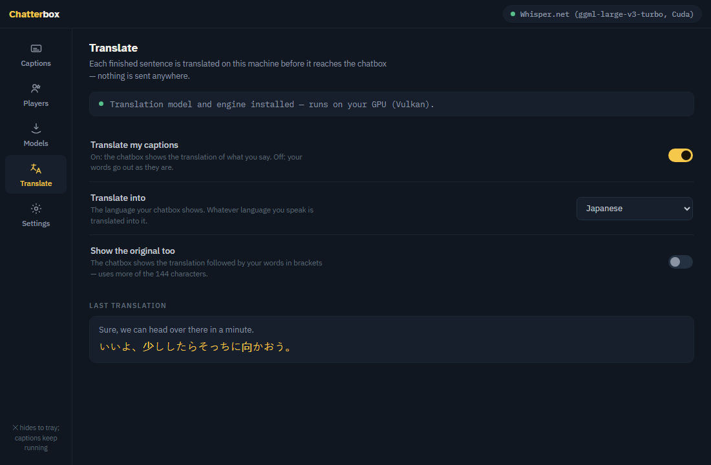

# Chatterbox

Live captions for VRChat, built for deaf and hard-of-hearing players. Your
speech is transcribed **on your own PC** and streamed into your in-game
chatbox — and, if you want, translated into another language first, also
on your own PC. Nothing you say ever leaves your machine: the only network
access is downloading the model files you ask for (checksum-verified) and
asking GitHub whether a newer version exists.

Works alongside the official VRChat client — no account login, no game
mod, no install.



## Features

- **Live captions in the chatbox** — two local engines: NVIDIA Parakeet
  (fast and accurate on any CPU, the recommended default) and OpenAI
  Whisper (multilingual, GPU-accelerated with the CUDA pack). The chatbox
  shows your last sentences within VRChat's 144-character window, with a
  typing indicator while you speak and a new line after a pause.
- **Translation** (1.7) — each finished sentence can be translated on your
  machine (Tencent Hy-MT2, 22 languages) before it reaches the chatbox,
  with or without your original words in brackets. Its own **Translate**
  tab; CPU or any GPU through Vulkan.
- **Auto-start players** — captions start when a chosen player is in your
  instance and stop when the last one leaves.
- **Lives and dies with VRChat** — one Steam launch option starts
  Chatterbox with the game and quits it with the game.
- **Falling-behind advice** — when recognition can't keep up, a one-click
  toast offers the fix for your machine; a built-in speed check rates every
  installed engine in under a minute.
- **In-app updates** (1.6) — one click fetches the next release from this
  repository's Releases page, verified against its published SHA-256.
- **Private by construction** — no telemetry, no accounts; every download
  is hash-pinned; the complete network list is under Privacy & network.

## Download

Get the latest `Chatterbox-<version>-win-x64.zip` from the **Releases**
page of this repository — it contains a single `Chatterbox.exe`, no
installer. Each release lists the zip's SHA-256; the running app shows its
version under **Settings → About**. The exe is not code-signed, so Windows
SmartScreen may warn on first run — choose **More info → Run anyway**.

## Quick start (60 seconds)

1. Chatterbox is a single `Chatterbox.exe` — put it in its own folder
   anywhere you can write to (Desktop, `C:\Tools\…` — **not** Program
   Files). On first launch it unpacks its bundled speech components
   (~2 MB) into a `runtimes\` folder next to the exe — that's why the
   folder must be writable — and optional downloads install there too.
2. In VRChat: **Action Menu → Options → OSC → Enabled**.
3. Run `Chatterbox.exe`. On first launch, pick a model:
   **Quick start** (~33 MB) or **Best quality** (recommended, ~670 MB —
   ~718 MB on NVIDIA machines, where it includes GPU acceleration).
4. Press **Start captions** and talk. Your words appear in the app and in
   your VRChat chatbox.
5. Optional: to caption in another language, open the **Translate** tab —
   it says what to download and holds the language switch (see
   Translation below).

Closing the window hides Chatterbox to the system tray — captions keep
running. Left-click the tray icon to reopen; right-click → Exit to quit.

## Auto-start players

On the **Players** screen, press **Auto-Start** next to someone in your
instance (or add a display name / `usr_` id by hand). With **Auto-start
captions** on, captions start whenever one of those players is with you and
stop when the last one leaves — across world changes, and even if you
launch Chatterbox mid-session.

## Start and stop with VRChat (Steam)

To have Chatterbox live and die with the game, set VRChat's Steam **launch
options** (Library → VRChat → Properties → Launch Options) to:

```
"C:\path\to\Chatterbox.exe" %command%
```

Steam then starts Chatterbox, which launches VRChat with its normal command
line and **exits automatically when VRChat closes**. Combined with
auto-start players, captions become fully hands-off. Launched normally
(without `%command%`), the app stays running independently in the tray.

## GPU acceleration

Whisper models run dramatically faster on NVIDIA cards: on the **Models**
screen, download **GPU acceleration for Whisper (CUDA)** (~143 MB) and
restart the app. Parakeet (the recommended engine) is fast on CPU either
way.

## Translation

Chatterbox can translate your captions before they reach the chatbox, so
people who read another language can follow you — still entirely on your
own machine. On the **Models** screen download the **Hy-MT2 1.8B
translation model** (1.1 GB, Tencent, Apache-2.0) and the **Translation
engine** (36 MB, llama.cpp); on any GPU — NVIDIA, AMD or Intel — the
optional **GPU acceleration for translation (Vulkan)** pack (20 MB) makes
it several times faster. It uses your graphics driver's Vulkan support,
and the translation runtime finds the GPU by running `vulkaninfo.exe`,
which the driver installs with it; without that tool the pack is not
used. The Translate banner and `last_boot.log`'s `translation:` line say
which build is really doing the work.

The **Translate** tab (new in 1.7.1) is where it all lives: a banner that
says whether the model and engine are installed (with an **Open Models**
button when they are not), the **Translate my captions** switch, the
**Translate into** language picker, **Show the original too**, and a
panel with the last sentence translated. Each finished sentence is
translated in about 0.1 s on a GPU and 0.5 s on a modern CPU; the chatbox
shows the translation, optionally followed by your original words in
brackets, and the Captions page shows it under your words. Whatever
language you speak is translated into the one you picked. If the model or
engine is missing, captions simply run untranslated and a toast says why.
The recognition engine and Whisper model selectors live on the Models
screen under **In use** (moved there from Settings in 1.7.0).



The model was chosen by a timed comparison of the small open-weight
translators (`docs/TRANSLATION_BENCH-2026-10-08.md`): the fastest one that
was also accurate. The picker lists the languages it does best.

## Requirements

- Windows 10/11, 64-bit.
- Microsoft Edge WebView2 Runtime — preinstalled on Windows 11 and current
  Windows 10; if missing, Chatterbox points you to Microsoft's one-click
  installer at startup.
- Any x64 CPU. With AVX2 and FMA (any desktop CPU from the last decade)
  Whisper runs at full speed; without them the bundled no-AVX build is
  used (slower — Parakeet is the better engine there, and
  `last_boot.log`'s "whisper natives" line says which build is in use).
- A microphone. VRChat can keep using it at the same time (shared mode).

## Updates

**Settings → Updates → Check for updates** asks the project's GitHub
Releases page for a newer version and installs it in place: the zip is
downloaded, checked against the SHA-256 published with the release, and
the new exe is put beside the running one; Chatterbox then exits, the new
exe takes the old one's name and the new version starts. **Check when Chatterbox starts**
(on by default since 1.7.0) tells you at startup when a new version
exists — it never installs anything by itself; switch it off under
Settings → Updates if you'd rather check by hand. Your settings, auto-start players, and
downloaded models live in `%APPDATA%\Chatterbox\` and survive updates;
the optional Parakeet engine and GPU acceleration packs install **next to
the exe** and survive too.

Manual updates still work: replace `Chatterbox.exe` with the one from the
new zip. Keep the app folder (just swap the exe); if you delete the whole
folder, re-download the packs from the **Models** screen. When a new
version needs a newer voice-detection model (under 1 MB), Chatterbox
downloads and verifies it by itself the first time it starts — the one
download it makes without you pressing Download.

To fully uninstall: delete the app folder, `%APPDATA%\Chatterbox\`,
`%LOCALAPPDATA%\Chatterbox\` (the embedded browser's cache), and the
registry key `HKEY_CURRENT_USER\Software\Chatterbox` (one value that
records the app has run before).

## Privacy & network

Chatterbox sends **no telemetry, no analytics, no pings — nothing.** Its
complete network activity:

- Downloading model files you request (Hugging Face, including the
  translation model) and the optional engine/GPU packs (nuget.org) — every download checksum-verified. The one
  download that starts on its own: after an update that changed the small
  voice-detection model, the new file (under 1 MB, same source, same
  checksum check) is fetched the first time Chatterbox starts.
- Checking for updates — when you press **Check for updates**, or at
  startup unless you switched that off under Settings → Updates (it is on by default): one request to GitHub's
  Releases API, which sees the app's name and version and nothing else.
- Caption text to VRChat over OSC on **your own machine only**
  (`127.0.0.1:9000` — never leaves the PC).

That is the entire list. The embedded WebView2 browser is additionally
launched with its background networking, component updates, crash upload,
and reliability pings disabled. Your speech is transcribed locally and is
never transmitted anywhere, and so is its translation.

## Troubleshooting

- **Nothing appears in-game**: check VRChat's OSC is enabled (Action Menu →
  Options → OSC). Chatterbox sends to `127.0.0.1:9000`.
- **Players says VRChat's log is empty**: VRChat is running with its own
  logging switched off, so there is nothing for Chatterbox to read — no
  world, no players, no auto-start. In VRChat, open Settings → Debug and
  turn Logging on, then rejoin your world; if Logging was already on,
  restart VRChat. `last_boot.log` notes when the log was found empty and
  when it started being written.
- **Start is disabled**: a recognition model and the voice detector must be
  installed first — the app guides you on first run; see **Models**.
- **Words appear slowly**: lower the update rate to 1.0 s (VRChat's rate
  limit is the floor), pick a smaller model, or add the GPU pack. Lag no
  longer grows with sentence length: once the earlier words of a long
  sentence are settled, Chatterbox re-transcribes only its recent seconds,
  and audio is queued when a pass runs long — up to one pass plus ten
  seconds of it; beyond that the oldest audio is skipped so captions catch
  up instead of lagging further. On the CPU, Whisper runs a shortened
  encoder context for speed.
- **Captions stopped on their own**: the mic was disconnected, a
  recognition pass failed (the red toast says which), or auto-stop fired
  because the last watched player left.
- **Translation is on but the chatbox shows my own words**: the Translate
  tab's banner says what is missing — the translation model (1.1 GB) and
  the Translation engine both come from the Models screen. If both are
  installed and the banner is green, look for a "Translation unavailable"
  toast and the `translation:` line in `last_boot.log`; a failed load
  falls back to untranslated captions rather than stopping them.
- **Settings or players missing after a launch**: check `last_boot.log` —
  it records which settings file was read and how many auto-start players
  it held. If the file was missing at start, Chatterbox keeps watching for
  it and reloads automatically once it appears (a toast confirms).
- **Captions fall behind while you talk**: the header chip says so
  ("falling behind 2.3× · 3.1 s late"), and after ten seconds of that
  Chatterbox offers the fix for your machine as a one-click toast — switch
  to Parakeet, use a smaller Whisper model, install GPU acceleration, or
  restart to activate it. `last_boot.log` records every session's pace
  (passes, average and worst pass time, worst lag) for bug reports.
- **Chatterbox crashed or vanished**: the next start notices (the
  `boot.inprogress` marker survived, and says whether the run died while
  starting, idle, or with captions running) and asks Windows whether it
  recorded a crash for that run. A recorded crash is copied into
  `error.log` and that start is a safe boot: captions are not auto-started
  until you press Start once, so a crash can never loop. A start that
  never reached the window is treated the same way. A run that was simply
  ended from outside — Task Manager, or a companion app that starts and
  stops Chatterbox with the game — is not a crash: `last_boot.log` notes
  it in one line and captions auto-start as usual. Signing out or
  shutting down with Chatterbox in the tray counts as a clean exit.
- **The Vulkan translation pack is installed but translation runs on the
  CPU**: the Translate banner, a toast at Start and the `translation:`
  line in `last_boot.log` say why. The translation runtime finds a Vulkan
  GPU by running `vulkaninfo.exe` (in `System32`, installed by the
  graphics driver) and quietly uses the CPU build without it — updating
  the graphics driver brings it back. A pack installed while translation
  was already running needs a restart. The `llama loader:` lines in
  `last_boot.log` name the library that was loaded.
- **An old CPU without AVX2/FMA**: the bundled no-AVX Whisper build is
  used automatically (`last_boot.log`'s "whisper natives" line says so).
  It is slower; Parakeet is the better engine on such a machine.
- Errors are logged to `%APPDATA%\Chatterbox\error.log`.

Don't run Chatterbox's captions at the same time as another chatbox
writer (any other speech-to-text or OSC chatbox tool) — they will fight
over the in-game window.

Bug reports are welcome — please attach `%APPDATA%\Chatterbox\error.log`,
`last_boot.log` (what the app saw at its last start, including the
machine it ran on) and, for anything speed-related, `bench.log` from
**Settings → Speed check**.

## Verifying on another machine

Two checks tell you within a minute whether Chatterbox is stable and fast
on a given PC — no VRChat session needed:

1. **Speed check**, in the app: **Settings → Speed check → Run**. Every
   installed engine transcribes a bundled 14-second clip; the table shows
   load time, the time for a 6-second pass (what live captioning repeats
   over and over), the full-clip time, how many words came out right, and
   a verdict. *fast* means captions run about a second behind speech,
   *usable* two to three, *too slow* means switch engine or model. The
   result is also written to `%APPDATA%\Chatterbox\bench.log` together
   with a line describing the machine — attach it to any "it's slow"
   report.
2. **Smoke test**, for testers with the repository: run
   `.\tools\smoke.ps1 -Exe C:\path\to\Chatterbox.exe`. It boots the app
   against a throwaway data folder and a fake VRChat log in which a
   watched player is already present, then reports PASS or FAIL for:
   survives, page connected, settings read, fake VRChat log read, boot
   auto-start check ran, no crash events. Nothing touches your real
   settings or game log.

Every `last_boot.log` starts with a `machine:` line (CPU, threads, RAM,
GPUs, Windows build, hardware tier), so a report from any machine says
what it ran on.

## What's new

- **1.7.2** — **the exe is never changed under a running process.** A
  single-file .NET exe reads every assembly it has not used yet from its
  own file, so the in-app update, which renamed the running exe aside and
  put the new one under its name before restarting, only worked as long
  as nothing new was loaded in between. Now the downloaded exe is staged
  beside the running one, Chatterbox exits, and the staged exe does the
  swap itself (waiting for the old process and its WebView2 browser to be
  gone) and then starts the new version. Also a round of stability work:
  when recognition cannot keep up, audio beyond one pass plus ten seconds
  is skipped instead of lagging further (`last_boot.log` says so); a
  recognition pass that throws stops the session with "recognition failed
  (…)" rather than captioning silence; Stop never frees the engine under a
  running pass (disposal is deferred until it returns) and no longer
  transcribes what is left in the window; Parakeet is handed at most 20 s
  per pass; a model or GPU-pack download that fails on the network keeps
  its partial file and the retry continues where it stopped; a settings
  save that fails says so instead of a silent "Saved". From the Linux
  build's audit: a CPU without AVX2/FMA gets the bundled no-AVX Whisper
  build, so both engines run there (the voice detector loads through it
  too); the crash marker now covers the whole run, so a crash during
  captions is recorded and the next start does not walk back into it —
  Windows' own crash record tells a crash from being ended from outside,
  so a companion app that stops Chatterbox when the game closes never
  costs the next launch its auto-start (sign-out and shutdown count as
  clean exits); the Translate tab says
  when translation runs on the CPU although the Vulkan pack is installed,
  and why; the microphone is chosen by the name you see, so a list that
  went stale after a USB unplug cannot pick another device; the Parakeet
  engine download resumes like the others; deleting a model also removes
  a half-downloaded file; a data folder deleted to reset the app reads as
  a first run again; and a repeated toast replaces its older copy instead
  of stacking up.
- **1.7.1** — the translator gets its own **Translate** tab on the left
  rail: install-status banner with an Open Models button, the switch, the
  language, "show the original too", and the last translation.
- **1.7.0** — **local translation**: Tencent's Hy-MT2 1.8B model through
  llama.cpp, fetched on demand as the model plus a CPU engine pack, with an
  optional Vulkan pack for any GPU vendor; chosen by a timed comparison of
  the small open-weight translators. The recognition engine and Whisper
  model selectors moved from Settings to **Models → In use**. The startup
  update check is now on by default.
- **1.6.1** — the update check explains a 404 from GitHub (no release yet,
  or a private repository).
- **1.6.0** — **in-app updates** from this repository's Releases page:
  check, verified download, exe swap and restart; optional check at
  startup.
- **Earlier** — Silero VAD v6.2.0 voice detector that updates itself
  (1.5.3); a Players-screen header that explains an empty VRChat log
  (1.5.2); speed check, smoke test and machine profile in every boot log
  (1.5.0); bounded re-transcription so lag no longer grows with sentence
  length (1.4.0); pace monitor with one-click fixes and crash-resilient
  boot (1.3.0).

## Building from source

Requires the .NET 9 SDK on Windows.

```
dotnet build Chatterbox.sln          # debug build + tests project
dotnet test src\Chatterbox.Tests\Chatterbox.Tests.csproj
.\build.ps1                          # release: single-file exe zipped into releases\
```

## License

Chatterbox is free software under the **MIT License** — see
[LICENSE](LICENSE). Third-party credits are in [NOTICE.txt](NOTICE.txt),
full third-party license texts in
[THIRD_PARTY_LICENSES.md](THIRD_PARTY_LICENSES.md), and all of it is also
shown in-app under **Settings → About**.

Speech recognition uses OpenAI Whisper models (MIT, ggml conversions by
whisper.cpp) and the NVIDIA Parakeet TDT 0.6B v2 model
([CC BY 4.0](https://creativecommons.org/licenses/by/4.0/), int8 ONNX
export by k2-fsa/sherpa-onnx), downloaded at the user's request and never
bundled.
